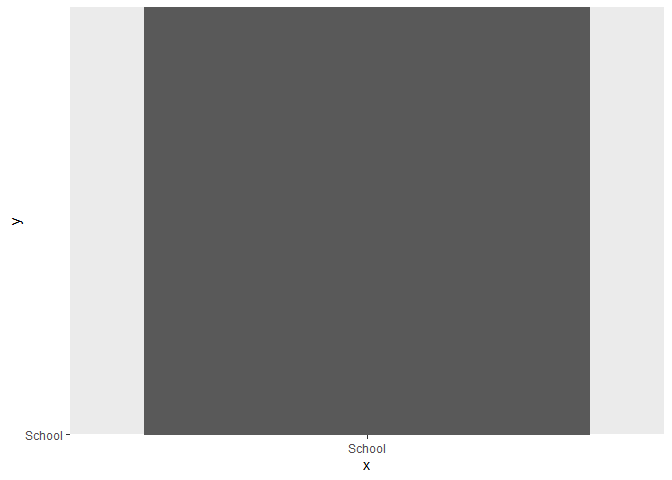

Data Analysis Project
================
Aashish Bharath

``` r
school_shooting_data <- read.csv("C:/Users/aashi/OneDrive - University of St. Thomas/Spring2023/DataVisualization/Project/school_shooting_data.csv")
```

``` r
library('ggplot2')
```

    Warning: package 'ggplot2' was built under R version 4.1.3

``` r
ggplot(school_shooting_data) + geom_col(aes(x='School', y = 'School'))
```


